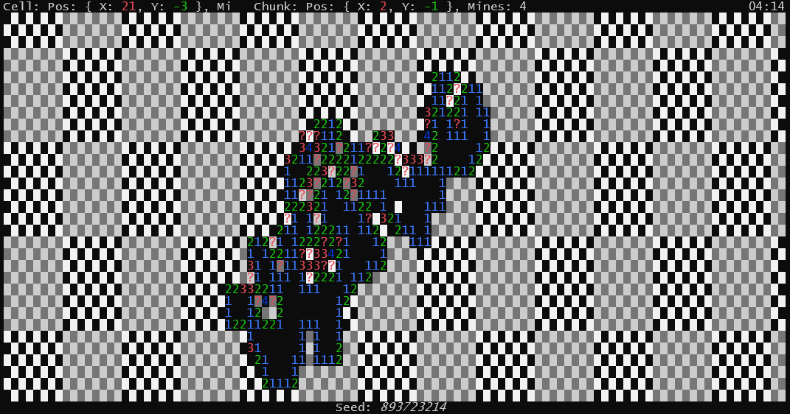

# Infinite Minesweeper

A .NET implementation of an infinite Minesweeper game that runs in the terminal.

## Features

- Infinite, procedurally generated grid
- Classic Minesweeper gameplay
- Responsive terminal UI

## CLI Options

You can customize the game at launch using one of the following options:

- `<number>`: Use a specific random seed for reproducible worlds
- `<path>`: Load a saved game from a file path

Example:

```bash
dotnet run --project InfiniteMinesweeper.App -- 12345
dotnet run --project InfiniteMinesweeper.App -- save.json
```

## Controls

- `Arrow keys`: Move the cursor
- `Spacebar`: Reveal/explore a cell
- `Enter`: Flag or unflag a cell
- `S`: Save the current game to `save.json`
- `L`: Load the game from `save.json`
- `Ctrl`+`C`: Exit the game

## Save/Load

The game can be saved and loaded using the `S` and `L` keys. The save file is stored as `save.json` in the working directory.


## Getting Started

### Prerequisites

- [.NET 10.0 SDK](https://dotnet.microsoft.com/download/dotnet/10.0)
- [Clone this repository](https://github.com/FaustVX/InfiniteMinesweeper.git)

### Running the Project

This game runs only in the terminal.

```bash
dotnet run --project InfiniteMinesweeper.App
```

## Contributing


You can [open a new issue](https://github.com/FaustVX/InfiniteMinesweeper/issues/new), [submit a pull request](https://github.com/FaustVX/InfiniteMinesweeper/compare), or [start a discussion](https://github.com/FaustVX/InfiniteMinesweeper/discussions) to contribute.

## License

This project is licensed under the MIT License.
